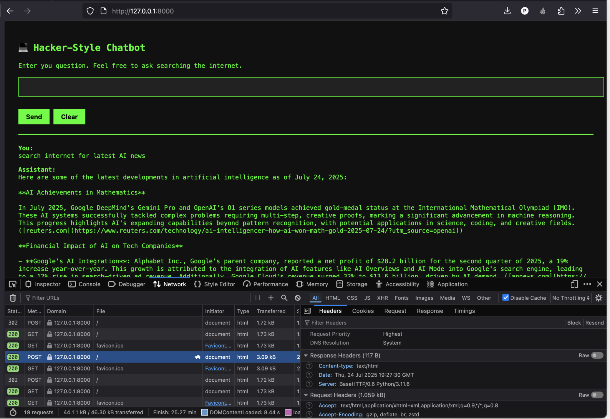

# Simple Chatbot with search


## Getting Started
```
python3 -m venv .venv
```
```
source .venv/bin/activate
```
```
pip install openai
```
```
export OPENAI_API_KEY=xxxxxxxxxx
```
## Run the app
Connect to `http://127.0.0.1:8000`
```
python main.py
```
